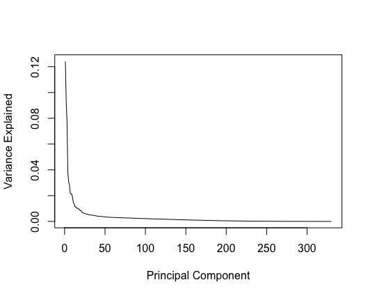

#Overview
In Wonderland, we explored a parallel world to Python's Yellowbrick library. Yellowbrick, still under construction during our project, helps with feature and model selection. Our approach was to assess Yellowbrick's performance coming from two angles:

  1. Manually run the data through different models to independently determine the best model
  2. Use R's sjPlot library, with similar functionality to Yellowbrick

## The Data: 1998 KDD Challenge: Charity
We chose to work with the 1998 KDD challenge cup data. With 422 variables and ~191K observations, it presented us with a tall challenge but was large enough to support a wide array of algorithms. The objective of the challenge was to predict both which recipients of a Charity mailing campaign would donate and how much they would donate. The challenge winners claimed their success resulted from strong variable selection. 

```{r}
#Insert code and/or plots here
```

### Cleaning
Who doesn't love cleaning data? We did the standard upfront cleansing by correcting missing values and standardizing dates. Recognizing the value of some categorical variables, we converted hand-selected columns to continuous. 

First, we read in the data that we saved into the data folder. We separate the data into target and explanatory variables. The two explanatory variables in the data are "Target\_B", whether they responded to the survey, and "Target\_D" what the respondent's donation was. "CONTROL\_N" is a record index. Our manipulation to clean the data will occur on explanatory variables, so we separate the two groups of variables to facilitate our transformations.

```{r eval=FALSE}
# Read in the Charity Data
raw = read.csv("data/cup98LRN.txt",header = TRUE)

#Identify target variables, create separate matrix
raw_y <- raw[,c("TARGET_B","TARGET_D")]

#Identify explanatory variables
x_vars <- colnames(raw[!names(raw) %in% c("TARGET_B","TARGET_D","CONTROLN")])

#Create separate Matrix of explanatory variables
raw_x <- raw[,x_vars]
```

For many of the models we are interested in testing we would like to utilize numeric data. Numeric columns that are constants are useless to us so we remove any columns without variance. *However, there is a caveat, if we had greater understanding regarding the data we may be able to draw useful from a variable that is a constant that may aid in future model development, simply: It is always best to know your data.*
```{r eval=FALSE}
#Select only numeric columns
numeric_cols <- sapply(raw_x, is.numeric)
raw_x_num <- raw_x[,numeric_cols]

#Remove constants 
raw_x_num <- raw_x_num[,apply(raw_x_num, 2, var, na.rm=TRUE) != 0]

```

We also remove variables that have less than 10% variance.
```{r eval=FALSE}
#Remove columns with less than 10% variance
raw_x_num <- raw_x_num[,apply(raw_x_num, 2, var, na.rm=TRUE) > 0.1]
```

Below we load a set of functions we have defined to help in the data cleansing process. We use the function missing.ratio which identifies what percentage of records are missing in a column. We subset to only include columns with at least 60% of their records, columns with less may not provide very much explanatory power.
```{r eval=FALSE}
source('clean_tools.R')

#Select features which  have more than 60% of their records
raw_x_rob <- raw_x_num[,apply(raw_x_num, 2, missing.ratio) < 0.4]
```

After completing a lot of the manipulations on the explanatory variables, we combine the two dataframes together. Both data.frames should have the same number of columns, since all the subsetting logic was applied to the columns.

We now turn our focus to the pattern of missing values within our remaining columns. The Mice package's md.pattern function to allows us to explore the pattern of columns with null values for a given observation and the relative number of records that match that pattern. We can place this data in a data.frame to facilitate exploration of the pattern of missing values for an observation across columns.
```{r eval=FALSE}
#Concatenate target and explanatory variables 
#Assign to a single dataframe
raw_clean <- cbind(raw_y,raw_x_rob)


#What is the pattern regarding missing values in the data?
miss_pattern <- md.pattern(raw_clean)
miss <- data.frame(miss_pattern) ```
```

Our review of the pattern of missing values indicates that we have 33,888 records with complete values, which seems adequate for continued model development analysis.
```{r eval=FALSE}
raw_complete <- raw_clean[complete.cases(raw_clean),]
```

## Manual Assessment
### Regression
We ran a few versions of regression and, using RMSE (Root Mean Squared Error) resolved that LASSO was the best-fitting model.

```{r}
#Insert code and/or plots here
```

## Beyond Regression
Next we did some more advanced stuff. 

### Principal Component Analysis.
The extensive number of columns involved in this dataset lead us to desire a manner to select only the most valuable columns for our analysis and model building. One common method of dimensionality reduction is Principal Component Analysis (PCA).
```{r eval=FALSE}
library(stats)

#Perform PCA with prcomp()
train.pca <- prcomp(train_x,
                 center = TRUE,
                 scale. = TRUE)
```

Principal Component Analysis allows us to reduce the dimensionality of the data and identify relatively the amount of variance each __Principal Component__ can explain. To visualise this, we create a plot to identify the number of variables the PCA determines are useful in explaining the variance within the data.
```{r eval=FALSE}
#explained variance
variance.explained <- train.pca$sdev^2 / sum(train.pca$sdev^2)
plot(variance.explained,type = 'l', xlab = 'Principal Component', ylab = 'Variance Explained')
```


Unfortunately there does not appear to be any indication that the any of the variables are overwhemingly useful to explain the variance observed.


## Using Pre-Built sjPlot package in R
Finally, we ran the Charity data through the sjPlot package in R. While not a perfect 1:1 comparison to Yellowbrick, sjPlot does aim to accomplish the same task. 

```{r}
#Insert code here
```

## Conclusion
There is no one-size-fits-all solution. Even when using helpful tools like the ones tested in this post, data scientists who excel at feature and model selection inevitably understand the algorithms behind each approach. That said, Yellowbrick is excellent at stepping a user through a variety of approaches, illustrating that one improves on another, thus lowering the barriers for those who have a surface comprehension of statistics. 

We look forward to having Yellowbrick as a fully-functioning library for the average pythonista. 